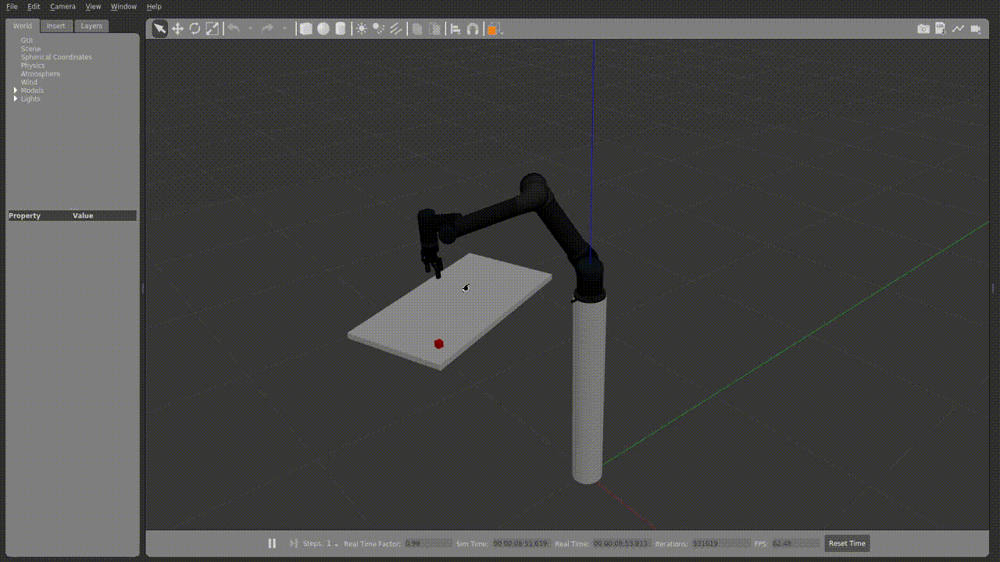

# ur5_pick_and_place
This repo contains files to simulate UR5 in Gazebo for pick and place task



# System Requirements #
- ROS1 Noetic

# Dependencies #
- [Link attachment plugin](https://github.com/pal-robotics/gazebo_ros_link_attacher) - This is used to attach links together in Gazebo(Used for picking and placing of objects).


# Installation #
```bash
# Clone the repo
git clone https://github.com/rohanNkhaire/ur5_pick_and_place.git

# Install dependencies
cd ur5_pick_and_place
rosdep update
rosdep install --from-paths src --ignore-src -y

# Build the packages
catkin_make

# Source the workspace
source devel/setup.bash
```

# Usage #
```bash
# Launch the gazebo demo
roslaunch ur5_moveit demo_gazebo.launch

# Spawn the object in the gazebo world
# Open a new terminal
rosrun gazebo_ros spawn_model -file `rospack find ur_description`/urdf/objects/box.urdf -urdf -x -0.5 -y -0.5 -z 1 -model my_object

# Run the pick and place script
cd gazebo_ros_link_attacher/scripts
python3 picknplace.py
```
